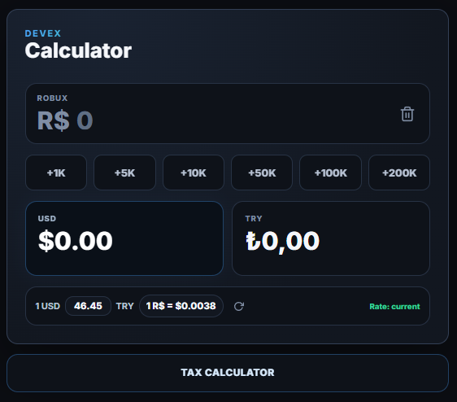

# DevEx Calculator

> Roblox DevEx calculations in a clean, fast, mobile-friendly interface.

**DevEx Calculator** converts Robux into USD and TRY, keeps the USD/TRY rate fresh, and includes a small Roblox tax calculator for net/gross Robux calculations.



## Features

| Feature | Description |
|---------|-------------|
| Robux → USD | Conversion using the DevEx rate: `1 R$ = $0.0038` |
| USD → Robux | Edit the USD result field to reverse-calculate Robux |
| TRY Conversion | Live USD/TRY exchange rate support |
| Manual TRY Rate | Override the rate when you need a custom value |
| Quick Amounts | `+1K` `+5K` `+10K` `+50K` `+100K` `+200K` buttons |
| Tax Calculator | Drawer for Roblox's 30% marketplace fee |
| Copy Helpers | One-click copy for result values |
| Dark UI | Responsive design for desktop and mobile |
| Local Caching | Saved values and exchange rate data persist |

## Usage

1. Open `index.html` in a browser.
2. Enter a Robux amount in the main input.
3. Review the calculated USD and TRY values.
4. Edit the USD field to reverse-calculate the matching Robux.
5. Use quick amount buttons to add common Robux values.
6. Adjust the TRY rate manually or refresh from the API.
7. Open **Tax Calculator** to compute net/gross Robux after fees.

## Tech Stack

- **HTML** – page structure
- **CSS** – responsive dark UI, animations, layout
- **Vanilla JavaScript** – calculations, state, API calls, UI
- **LocalStorage** – caching for Robux and exchange rate state
- **[open.er-api.com](https://open.er-api.com)** – USD/TRY exchange rate data

## Project Structure

```
.
├── index.html      # App markup
├── style.css       # UI, responsive layout, theme, animations
├── app.js          # Conversion logic, tax calculator, API/cache
├── favicon.png     # Browser icon
├── screenshot.png  # App preview
└── README.md       # Project documentation
```

## Calculation Notes

- DevEx rate: `DEVEX_RATE = 0.0038` (defined in `app.js`)
- Roblox tax: `TAX_RATE = 0.30`
- TRY rate fetched from `https://open.er-api.com/v6/latest/USD`
- Fetched rates are cached for one day
- Falls back to cached or manual rate if the API is unavailable

## Development

No build step required.

```bash
# Open directly in your browser
index.html

# Quick syntax validation
node --check app.js
```

## License

MIT
